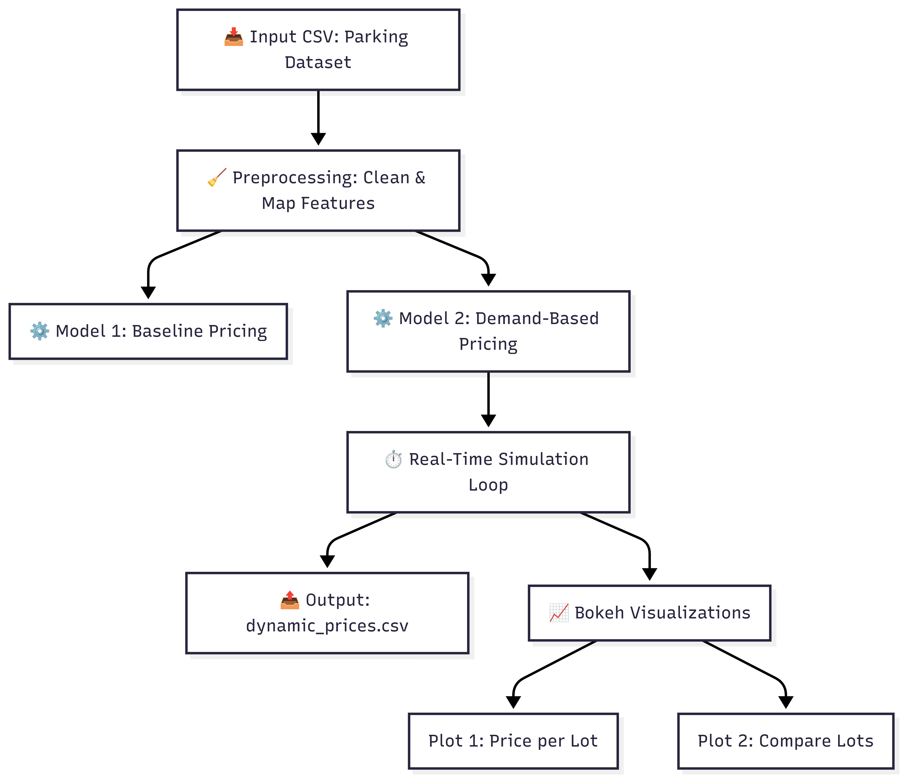

# Sarthak_Sonkar_SA2025
# 🚗 Dynamic Pricing for Urban Parking Lots

This project implements a real-time **dynamic pricing system** for urban parking using Python, Bokeh, and Pathway. The goal is to optimize parking space usage, reduce congestion, and improve pricing fairness using demand-driven logic.

---

## 🛠️ Tech Stack Used

- **Python** (Pandas, NumPy, Matplotlib)
- **Bokeh** for interactive data visualization
- **Google Colab** for development
- **Pathway** (logic simulation; integration-ready)
- **Panel** (optional for interactive UI)
- **GitHub** for version control and collaboration

---

## 🧠 Project Overview

### 🎯 Objective:
Design a dynamic pricing model that adjusts parking prices based on:
- Occupancy
- Traffic conditions
- Queue length
- Special events
- Vehicle type

### 💡 Key Features:
- Demand-based pricing model
- Real-time data simulation
- Interactive Bokeh visualizations
- Competitor price comparison
- Clean, well-documented notebook

---

## 🧱 Architecture Diagram

---

## 🏗️ Project Workflow
1. **Data Ingestion**: Load CSV file with parking lot activity
2. **Preprocessing**: Combine timestamp, normalize occupancy, encode traffic & vehicle type
3. **Modeling**:
   - Model 1: Baseline pricing (simple ratio)
   - Model 2: Contextual demand pricing (queue, traffic, event, vehicle)
4. **Real-Time Simulation**: Feed batches of data through pricing models
5. **Visualization**: Plot real-time prices and compare competitor prices with Bokeh
6. **Output**: Export results to `dynamic_prices.csv`

---
